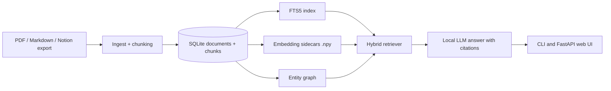

# DocAgent Studio

**Local-first RAG with verifiable citations, offline execution, and no required cloud APIs.**

DocAgent Studio ingests PDFs, Markdown notes, and Notion exports into a local SQLite database, retrieves context with hybrid lexical plus vector search, and answers questions with traceable citations.

## What Is Live Today

- CLI ingest for PDFs, Markdown, and exported Notion content
- SQLite-backed storage with FTS5 lexical search and local embedding sidecars
- FastAPI web UI for ingest, indexing, search, Q&A, and graph exploration
- Citation-grounded answers with local Ollama models
- Lightweight entity graph for GraphRAG-style navigation
- Eval commands for retrieval recall and citation coverage
- Optional MLX LoRA dataset export for on-device fine-tuning

## Proof In Repo

- Web app: [`src/docagent/web/server.py`](src/docagent/web/server.py)
- Hybrid retrieval: [`src/docagent/index/retriever.py`](src/docagent/index/retriever.py)
- Eval runner: [`src/docagent/eval/run_eval.py`](src/docagent/eval/run_eval.py)
- Graph build and query flow: [`src/docagent/graph/build.py`](src/docagent/graph/build.py), [`src/docagent/graph/query.py`](src/docagent/graph/query.py)
- CI workflow: [`.github/workflows/ci.yml`](.github/workflows/ci.yml)
- Design notes and smoke metrics: [`docs/paper.md`](docs/paper.md)

## Architecture



## Quick Start

### 1. Install

```bash
python3 -m venv .venv && source .venv/bin/activate
pip install -e .
```

For the web UI:

```bash
pip install -e '.[web]'
```

### 2. Ingest documents

```bash
docagent ingest --input /path/to/your/docs --db ./data/docs.db
```

Supported inputs:

- `*.pdf`
- `*.md`
- `*.markdown`
- `*.txt`

For Notion exports, unzip the Markdown export and point `--input` at the extracted folder.

### 3. Build the indexes

```bash
docagent index --db ./data/docs.db
```

This creates:

- SQLite FTS data inside the database
- `docs.db.chunk_ids.npy`
- `docs.db.embeddings.npy`

### 4. Ask questions locally

```bash
ollama pull llama3.2:1b
docagent ask --db ./data/docs.db "What did I write about attachment theory?"
```

### 5. Run the web UI

```bash
docagent serve --db ./data/docs.db
```

Then open `http://127.0.0.1:8000`.

## Verify And Debug

Inspect a cited chunk:

```bash
docagent show --db ./data/docs.db --source-ref "md:notes.md#L9"
```

Check local dependencies:

```bash
docagent doctor --db ./data/docs.db
```

Inspect retrieval directly:

```bash
docagent search --db ./data/docs.db "secure base" --k 5
```

## Evaluation And Reliability

Run retrieval-only eval:

```bash
docagent eval --db ./data/docs.db --eval ./eval/sample_eval.jsonl --k 8
```

Run eval with answer generation:

```bash
docagent eval --db ./data/docs.db --eval ./eval/sample_eval.jsonl --k 8 --generate
```

Smoke results recorded in [`docs/paper.md`](docs/paper.md):

- retrieval recall@3: `1.000`
- citation coverage: `1.000`

Those numbers come from a tiny bundled smoke set. They validate the pipeline, not broad benchmark performance.

## Graph And Training Extras

Build the entity graph:

```bash
docagent graph build --db ./data/docs.db
docagent graph query --db ./data/docs.db "Attachment"
```

Export training data:

```bash
docagent make-trainset --db ./data/docs.db --out ./train.jsonl --n 500
docagent make-trainset-dir --db ./data/docs.db --out-dir ./data/trainset --n 2000
```

## Tests

```bash
python -m unittest discover -s tests -p 'test_*.py'
python -m compileall -q src
```

## Current Limitations

- Citation quality still depends on the local model you run through Ollama.
- The graph layer is heuristic and can miss or over-include entities.
- Vector search is intentionally simple and optimized for personal corpora, not large-scale multi-tenant workloads.
- This repo is focused on single-user local retrieval, not shared multi-user knowledge bases.

## Paper

See [`docs/paper.md`](docs/paper.md) for the design notes, smoke training run, and evaluation summary.

## License

MIT
