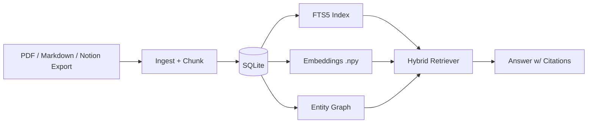

# DocAgent Studio: A Local-First Personal Docs Assistant (PDF + Notion + Markdown)

**Author:** Felmon Fekadu  
**Date:** 2026-02-15  

## Abstract

DocAgent Studio is a local-first personal knowledge assistant that ingests PDFs, Markdown notes, and Notion Markdown exports into a compact SQLite database, supports hybrid retrieval (FTS5 + embeddings), and produces answers with verifiable citations. The system is designed to run on consumer hardware (tested on a MacBook Air M2 with 8GB RAM) and includes an optional on-device fine-tuning pathway using MLX LoRA to adapt small instruction models to a citation-first, grounded answering style.

## Motivation

Personal knowledge bases tend to be:

- Heterogeneous: PDFs, exported notes, Markdown, code snippets.
- Large and growing: hard to re-find details.
- Private: uploading to third-party services is undesirable for many users.

The design goal is pragmatic: **make it easy to search and answer questions from personal documents locally**, with citations that allow the user to verify every claim.

## System Overview

At a high level, DocAgent Studio is a pipeline:

1. **Ingest** documents into SQLite (documents + chunks).
2. **Index** chunks for retrieval:
   - Lexical: SQLite FTS5 (BM25).
   - Vector: local embeddings stored as `.npy` arrays.
3. **Retrieve** with a hybrid scorer.
4. **Answer** with a local LLM (Ollama) using retrieved sources and inline citations.
5. (Optional) **Knowledge Graph** index from chunk entity co-occurrences.
6. (Optional) **Fine-tune** small models on-device (MLX LoRA) using exported JSONL.



## Data Model

SQLite tables:

- `documents`: one row per file, keyed by path + sha256.
- `chunks`: chunked text with `source_ref` (e.g., `pdf:book.pdf#p12.c2`, `md:notes.md#L90.c1`).
- `chunks_fts`: an FTS5 virtual table over `chunks.text`.

Vector index sidecars next to the DB:

- `docs.db.chunk_ids.npy`
- `docs.db.embeddings.npy`

Graph tables (optional):

- `entities`, `chunk_entities`, `entity_edges`

## Chunking Strategy

Chunking is designed to produce stable citations:

- PDFs: chunk per page, then split long pages; `source_ref = pdf:<rel>#p{page}[.cN]`.
- Markdown/Notion: split by heading hierarchy, then by paragraph; `source_ref = md:<rel>#L{start}[.cN]` or `notion:<rel>#L{start}[.cN]`.

This makes citations:

- Human-readable and stable across re-indexing (as long as the file structure is stable).
- Easy to map back to the original document.

## Retrieval

DocAgent uses a simple hybrid retriever:

- Vector similarity: cosine between normalized embeddings.
- Lexical: FTS5 BM25 scores.
- Combined score: `alpha * cosine + (1 - alpha) * lexical_score`

For robustness, user queries are sanitized into an OR-of-tokens FTS5 query to avoid syntax errors on punctuation.

## Answering With Citations

The answering prompt enforces:

- Use only the provided SOURCE blocks as ground truth.
- Inline citations in square brackets like `[md:notes.md#L9]`.
- No external sources/URLs.

Because small local models can be inconsistent, the system includes a fallback:

- If the model output fails grounding checks, return extractive excerpts with citations.

This ensures the user always gets a verifiable output.

## Knowledge Graph (GraphRAG-Style)

DocAgent builds an entity co-occurrence graph from chunks using heuristic entity extraction (capitalized phrases + acronyms). The graph supports:

- Finding “communities” of related entities.
- Boosting navigation and exploration: “show neighbors” and “show example chunks”.

This is intentionally lightweight and local-first; it is a stepping stone to more advanced GraphRAG approaches (LLM-based entity extraction, community summaries, and graph-conditioned retrieval).

## Fine-Tuning Path (On-Device)

DocAgent can export training data as JSONL in OpenAI-style chat format:

- `docagent make-trainset-dir --db ... --out-dir ...`

This is compatible with **MLX LoRA** on Apple Silicon. The goal is to adapt small instruction models to:

- Follow “use only provided sources”
- Use correct inline citation style
- Avoid hallucinated bibliographies

### Smoke Training Result (This Repo)

On a MacBook Air M2 8GB, a tiny MLX LoRA smoke train was run successfully:

- Model: `mlx-community/Qwen2.5-0.5B-Instruct-4bit`
- Dataset: `data/smoke/trainset/` (synthetic extractive Q/A)
- Run: 5 iterations, peak memory ~0.58 GB
- Output: `adapters.safetensors` + `adapter_config.json`

This validates the end-to-end fine-tuning loop (dataset export -> LoRA training -> adapter load for inference).

## Evaluation

DocAgent includes evaluation support with two metrics:

1. **Retrieval recall@k**: whether required sources are retrieved.
2. **Citation coverage** (optional generation mode): whether the answer cites required sources.

Example eval JSONL row:

```json
{"question":"Define secure base.","required_sources":["md:notes.md#L9"]}
```

### Smoke Evaluation Result (This Repo)

On a small smoke set (2 examples) over the bundled example notes:

- retrieval recall@3: 1.000
- citation coverage: 1.000

This validates that the plumbing works; meaningful evaluation should be done on a larger personal corpus with a curated eval set.

## Limitations

- **Citation style reliability** depends on the chosen local model; smaller models may require more extractive fallbacks.
- **Entity extraction** in the graph is heuristic; it can miss entities or include false positives.
- The current system does not implement advanced chunk re-ranking, query rewriting, or long-form summarization pipelines.

## Future Work

- Graph-conditioned retrieval: use the entity graph to expand queries and re-rank chunks.
- Better Notion export handling: richer metadata, database exports, attachments.
- MLX backend in `docagent ask`: run fine-tuned adapters directly without an external server.
- More rigorous evaluation: multi-hop QA, needle-in-haystack retrieval, citation precision/recall.

## Reproducibility

Core workflow:

```bash
pip install -e .
docagent ingest --input /path/to/docs --db ./data/docs.db
docagent index --db ./data/docs.db
docagent ask --db ./data/docs.db "Your question"
```

Web UI:

```bash
pip install -e '.[web]'
docagent serve --db ./data/docs.db
```

Tests:

```bash
python -m unittest discover -s tests -p 'test_*.py'
```

